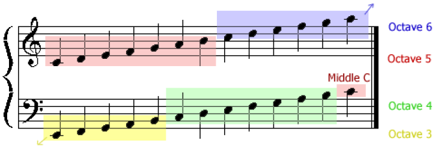
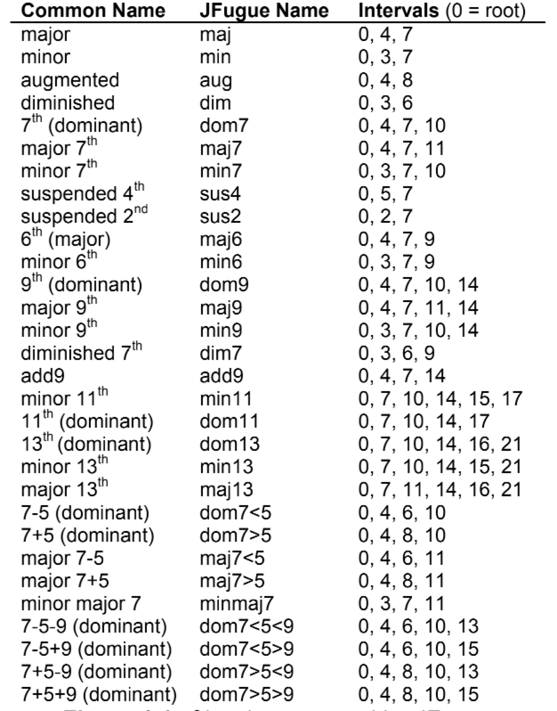
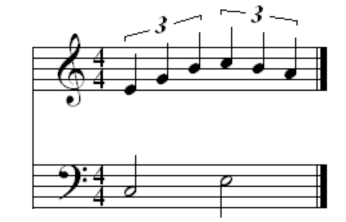
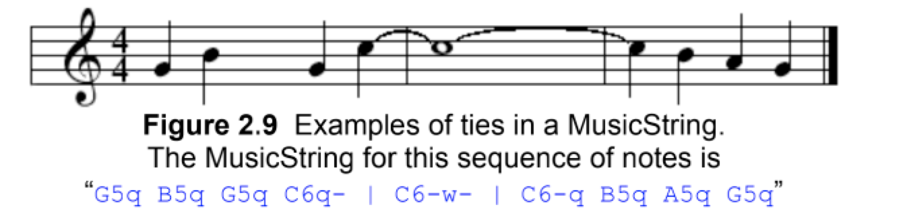
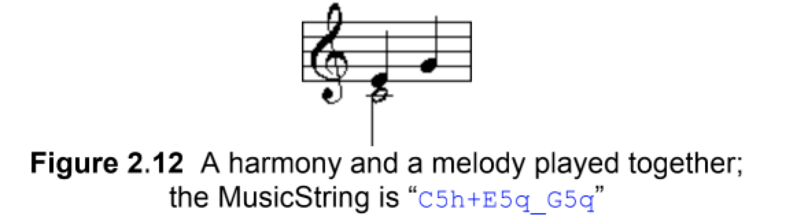

## 简介
由音符、八度、音长、音色（乐器，默认乐器为钢琴）组成
和弦、连音、速冻、控制器、键签名

Jfugue 可以简单并且允许工程师去快速创建音乐的原因是 MusicString，一个特殊格式描述音乐的字符串对象。

例如，播放 C（哆） 音符，可以使用如下简单的程序

```java
Player player = new Player(); 
player.play("C");
```

JFugue 解析 MusicString 并且创建对象标识每一个音符、乐器等。这些对象将用来生成音乐，并且通过扬声器播放。JFugue MusicString 不区分大小写。接下来的例子将会看到大小一致的样式，虽然 JFugue 不需要解析这种特定样式即可正确解析 MusicString，但尽可能让 MusicString 可读。


## 学习部分 MusicString

例子
```java
 Player player = new Player(); 
 player.play("C"); 
 player.play("C7h"); 
 player.play("C5maj7w"); 
 player.play("G5h+B5h+C6q_D6q"); 
 player.play("G5q G5q F5q E5q D5h"); 
 player.play("T[Allegro] V0 I0 G6q A5q V1 A5q G6q"); 
 player.play("V0 Cmajw V1 I[Flute] G4q E4q C4q E4q"); 
 player.play("T120 V0 I[Piano] G5q G5q V9 [Hand_Clap]q Rq");
```

每个通过空格分来的一个或多个字符，被称为一个 Token，一个token 代表一个音符、和弦或停顿；一个一起改变；一个声音或者层的改变；一个速度指示；一个控制事件；一个不变的定义；或者其他，更多的详情在这个章节展开。上面的例子第一个，前四个 MusicString 每个包含一个 Token，并且后面的 MUsicString 每个包含 8 个Token。

## 音符、停顿、和弦

音符和停顿的说明以音符名称或者停顿字符开始，分别是如下
 `C`(哆), `D`(来), `E`(咪), `F`(发), `G`(索), `A`(拉), `B`(西), or `R`(停顿)。除了音符说明本身，还可以追加一些 尖、平、八度、音长、和弦等等。

 一个音符也可以用数字表示，这个可用于创建“算法”音乐，每个音符都可以使用数组只而不是字母。一个数字音符将提供描述一个音符 MIDI 值，在方括号中，例如 `[60]`。八度已经作为因复制的因数，因此在提供音符值的时候不必指定八度（也不可能）。数值不能超过 127

Octave | C | C#/Db | D | D#/Eb | E | F | F#/Gb | G | G#/Ab | A | A#/Bb | B | 
|-|-|-|-|-|-|-|-|-|-|-|-|-|
0 | 0 | 1 | 2 | 3 | 4 | 5 | 6 | 7 | 8 | 9 | 10 | 11 | 
1 | 12 | 13 | 14 | 15 | 16 | 17 | 18 | 19 | 20 | 21 | 22 | 23 | 
2 | 24 | 25 | 26 | 27 | 28 | 29 | 30 | 31 | 32 | 33 | 34 | 35 | 
3 | 36 | 37 | 38 | 39 | 40 | 41 | 42 | 43 | 44 | 45 | 46 | 47 | 
4 | 48 | 49 | 50 | 51 | 52 | 53 | 54 | 55 | 56 | 57 | 58 | 59 | 
5 | 60 | 61 | 62 | 63 | 64 | 65 | 66 | 67 | 68 | 69 | 70 | 70 | 
6 | 72 | 73 | 74 | 75 | 76 | 77 | 78 | 79 | 80 | 81 | 82 | 83 | 
7 | 84 | 85 | 86 | 87 | 88 | 89 | 90 | 91 | 92 | 93 | 94 | 95 | 
8 | 96 | 97 | 98 | 99 | 100 | 101 | 102 | 103 | 104 | 105 | 106 | 107 | 
9 | 108 | 109 | 110 | 111 | 112 | 113 | 114 | 115 | 116 | 117 | 118 | 119 | 
10 | 120 | 121 | 122 | 123 | 124 | 125 | 126 | 127

## 尖、平、自然

可以使用 `#` 字符表示尖音，用 `b` 字符标识平音，`#`或`b`紧跟字符即可，例如 一个 `B-平` 可以表示为 `Bb`,JFugue 也支持 `双尖` 或者 `双平` 分别使用 `##` 和 `bb` 表示。

如果使用 键值标识（Key Signatures），你可以表示一个自然的音符通过在音符后使用 `n`，例如 `B-自然` 可以表示为 `Bn`。如果没有指明 `B` 为一个自然的，JFugue将自动改变音符的只基于键值标识（如果键值为 `F-major`，那么 `B` 将自动被覆盖通过 `B-平`）。后续将对 键值标识丛详细阐述。 

## 八度
默认 音符 5，和弦 3
允许给音符指定八度，使用 0-10 之间的数字表示。例如 `C6` 播放一个 `C` 音节在第六八度。如果没有八度说明，默认一个音节为第五八度，并且默认一个和弦第三八度。 




## 和弦
表示和弦需要先指定和弦的跟，JFugue支持多种和弦，下标中有详细描述

表格中的间隔表示和弦音符，例如，一个大和弦包含三个音符，用 `0,4,7`表示，这里定义的和弦是由跟（0），跟家四个半步（4）和跟加七个半步（7）组成。然而一个 `C-majo` 和弦是有音符 `C,E,G` 组成。



在 MusicString 中指明和弦，提供一个跟音符紧跟着通过上表中“JFugue Name”。例如 播放一个 `C-major` 和弦在默认八度中，可以使用 `C-major` MusicString，这个等效于 C+E+C，JFugue 会根据指定的和弦去填充对应的音符。回想一下，和弦的默认八度是第三个八度，它低于单个音符的默认五度。

若要指定带有和弦的八度，请在和弦根后面跟随八度数。例如，E-flat,6<sup>th</sup>，major 和弦 可以使用 `Eb6maj`。记住八度音阶放置位置的一种简单方法是，八度音阶更详细地描述了根音，因此它应该在根音旁。如果和弦名称后面有一个数字，则该数字与和弦本身相关联：例如，`Cmaj7` 描述的是C大调第七和弦，而不是七八度音阶的C大和弦。

## 和弦反转

和弦反转是演奏和弦音符的另一种方法，通过改变和弦中的那个音作为根音。有时候将其称为“和弦发声”。

第一次倒置表示和弦的常规根音应上移八度，使和弦中的第二个音符成为新的低音音符。第二个倒置表示和弦的根音和第二个音符应高八度，使和弦的第三个音符成为新的贝斯音符。具有三个以上成员的和弦可以进行第三次反转，具有四个以上成员的和弦可以进行四个反转，依此类推。和弦反转的例子如下图
](./images/1600328899345.png)

和弦反转也可以明确的指出将要成为新低音音符的音符来描述。可能在分页乐谱中看到 C/E 和弦。 C-Major 表示用`E`音符作为基础音符。

有两种方法可以再 JFugue 中指定和弦反转。第一个与指示和弦的第一，第二，第三等倒置一致。如上街所述，指出和弦（例如 `Cmaj` 为 CMajor）然后再每个反转音符后加入 ^。如上图所示，第一次反转变成`Cmaj^`，第二次反转变成`Cmaj^^`。带有更多音符的和弦可能会进行其他反转。

第二种方法与指示和弦的新低音音符一致，请按照上一节中的指示说出和弦（对于C-Major，为`Cmaj`），然后使用尖号字符^，后跟新的低音音符。例如将 `E` 作为新的低音音符的 C-Major 反转将为 `Cmaj^E`，将 `G` 作为新的低音音符的 C-Major 反转将为 `Cmaj^G`

## 音长
默认为 四分（`q`）

音长表示音符将播放多长时间，它放置在八度音阶之后（如果指定了和弦，则放置在和弦之后），或紧接在音符本身之后（如果省略了八度）或将音符指定为值。音长可由下面字母之一表示，如果未指定工期，将使用默认的四分。

Duration | Character
|-|-|
whole | w
half | h
quarter | q
eighth | i
sixteenth | s
thirty-second | t
sixty-fourth | x
one-twenty-eighth | o

例如，一个 `C6` 音符，半分音长即为 `C6h`。一个 D-flat major 音符， 全音长即为 `DbmajW`.

点线的音长可以使用音长后使用`.`字符来指定。带点的半音使用 `h` 后面加英文句号`h.`来表示。一个点表示原始持续时间的 1.5 倍。半分加线等于四分之半分加四分。

持续时间可以彼此附加以创建较长持续时间的音符。这类似音乐中的一个 “tie”，例如播放 `D6` 三个节拍，可以使用 `D6www`。

持续时间也可以通过数字指定。这种情况下，提供等于整个音符部分的十进制。要表示数字持续时间，请使用斜杠字符，后跟一个十进制值。例如播放 A4 音符四分音长，可以使用 `A4/0.25`。1.0 表示整个时间，小数位数大于 1.0 表示音符跨多个小节。例如 上面给出的例子 `D6www` 等价于 `D6/3.0`。使用数字作为音长可能对”算法“ 音乐有用处。它们也会在JFugue解析MIDI文件时生成MusicStrings时创建。下面是一些关于音长的例子。
```java
 player.play("Aw"); // A5 whole note 
 player.play("E7h"); // E7 half note
 player.play("[60]wq"); // Middle-C (C5) whole+quarter note
 player.play("G8i."); // G8 dotted-eighth note
 player.play("Bb6/0.5"); // B-flat, 6th octave, half note
// C-major chord, second inversion, 7th octave, quarter note 
 player.play("C7maj^^q");
```

## 三连音和其他连音
连音是一组音符，音符的音长会被调节，使得该组音符的持续时间与下一个最长的音符音长一致，如下图

三连音是连音一种特殊形式，该组有是哪个音符。三连音是最常见的连音符，其他连音符也可能存在（在音乐理论和 JFugue中）。三连音，三个音符以接下来最大的音长相同的方式演奏。这事一个 3:2 三连音。一个三连音组成四分音符，正如上图所属，这意味着该组音符将在一个半音符中播放，所以每个音符将在正常音长的 2/3 中播放。

例如更多音符 - ，一个五重奏，包括五个音符，如果他们是一个 5:4 连音，那么五个四分音符将播放在同样的音长中作为整个音符 每个音符将播放正常四分音长的 4/5。

在JFugue中指定连音符，使用型号 `*`，在连音符的音符持续时间符号后。三连音，这样做就可以了。其他连音，星号后面必须紧跟描述连音的比例，例如 `5:4` 。每个连音在音符中都必须有连音符号，并且连音符的每个比例都相同（如果不是不会影响解析，只是音乐挺起来回变得很怪）。

例子，这些行中的每行将以三重奏的形式演奏三个四分音符，四分之三的组的持续时间为四分之三（等于二分音符）
```java
player.play("Eq* Fq* Gq*"); // These two lines create
player.play("Eq*3:2 Fq*3:2 Gq*3:2"); // equivalent music
```
 这五个八分音符（五重奏）将在四个八分音符（相同的一半音符）的持续时间内演奏。
 ```java
 player.play("Ci*5:4 Ei*5:4 Gi*5:4 Ei*5:4 Gi:5*4");
 ```
 
 ## 小节（tie）
 
 在乐谱中，tie 链接两个相同音高的音符。并只是将两个音符作为一个音符演奏，总持续时间等于并列音符的持续时间之和。乐谱中经常使用 tie 来描绘音符，该音符的持续时间跨越两个小节之间的小节线，如下图。tie通产被用来创建音符的持续音长，所以不能用注释代替掉，例如半音符加八分音符。
 
 
 在 JFugue 破折号 `-` 备用来表示 tie。对于一个 tie 开始的音符，追加破折号到其音长的结尾。对于在 tie 结尾的音符，将破折号放在持续时间的开头，如果一个音符在一系列连在一起的音符中间，使用两个破折号，持续时间前后都加。使用破折号表示 tie 是否 ”跟随“ 音符的音长，是否”继续“音符的音长， 节点是否在 tie 中，这种情况下，tie 即”跟随“又”继续“持续时间。它将使用”测量“符号（垂直线或者竖线字符 ”|“），如下图
 
 
 ## Attack(起) and Decay(落) 速度
 默认 64 attack, 64 decay
 
 音符可以指定起音及落音速度，这些速度表明音符“预热”到其全部音量需要多长时间，并且从峰值”消散“，例如 一个音符需要一个很长的起音和一个很快的落音，就像建立的时候需要一段时间，很快关闭。长时间发作的音符听起来有些空灵，具有长衰减声的音符像被敲击的铃铛或吉他弦一样，在被敲击后会继续产生共鸣。
 
 音符的起音和落音可以分别使用字母`a`和`d`来指定，每个字母后面紧跟数字 0-127，默认为 0。较低的值表示起音或者落音的更快，较高的值表示其更长。起落音可单独使用（如果他们一块出现，需要先指定起音）
 
 例如，下面这些带有起落速度的音符
 ```java
player.play("C5qa0d127"); // Sharp attack, long decay
player.play("E3wwd0"); // Default attack, sharp decay
player.play("C7maja30"); // C7, E7, and G7 (components of 
// C7maj) will all play with an 
// of attack 30
 ```
 ## 音符演奏旋律及和声
 这事演奏旋律的音符 -，一个接一个–用空格分隔的单个标记表示。至此，所有MusicStrings示例都显示了旋律演奏的音符。
 如下图所示，
 
 音符也可以与其他音符一起和谐演奏，这可以通过将标记与加号`+`结合使用来指明而不是空格，如下图所示。当然，和弦中的音符自动和声演奏，`+`标记可让您和声演奏任何音符。
 
 
还会发现在某些情况下要和声地演奏一个音符而两个或多个音符会以旋律演奏。表示在与其他音符和声演奏时应一起演奏的音符，使用下划线字符`_`连接应一起演奏的音符。`C5`音符会连续播放，而`E5`和`G5`音符会依次播放。


和弦和休息音也可以和声或组合演奏使用加号和下划线字符作为连接符的和声/旋律，只有音符，和弦和休止符可以使用`+`和`_`字符。

## 计量
JFugue MusicStrings的创建旨在使音乐创作变得容易，它们不是为提供代表乐谱的完整语法而开发的。在MusicString中指示小节线`|`不会影响MusicString的音乐输出。但是，在MusicString中指示小节之间的中断通常很有用。要指示条形线，请使用垂直线（或竖线）字符`|`，该字符必须与MusicString中的其他标记分隔并带有空格。

## 键值标识（Key Signature）
默认为: C-major

一个键值标识被用来指明JFugue以特定的键或音阶播放MusicString。指明键值标识，使用字母`K`，后面紧跟键值的根，然后是 `maj` 或 `min` 主要或次要规模。例如 `KCbmaj` 将被记做键至为 C-flat major.

JFugue 将自动为受键值标识影响的音符调整音符值。例如，如果设置键值为 `F-major`，那么播放一个 B 音符在 MusicString 中，JFugure 将自动替换 `B` 为` B-flat`。如果想 `B` 保持自然形式，必须在每个音符后通过使用自然符号标识`n`，这种情况，演奏 `B` 作为自然音符需要令牌 `n`。

## 仪器
默认为  Piano（钢琴）

JFugue 产生的音乐使用 MIDI 来渲染由 Java Sound 音库中的乐器播放的音频，MIDI 规范描述了128种不同的乐器并且可能支持更多。大多数 MIDI 设备的前128个乐器使用相同的定义，尽管声音的质量因设备和音库而异。例如，MIDI 乐器`#0`通常代表一架钢琴，但是各种 MIDI 设备渲染的钢琴声音可能不同。

在 JFugue 的 MusicString 中选择这些乐器，使用工具令牌，它是`I`字符，后跟0到127之间的工具编号。例如要指定钢琴，可以输入 MusicString `I0`。或者 JFugue 使用仪器名称定义了可用于指定仪器的常量。这往往更容易阅读和记住，例如 钢琴常熟为 PIANO，因此用于指定钢琴的 MusicString 也可能显示为`I[Piano]`。也可以定义自己的常量，本章后面将更详细地描述常量。如下表包含仪器编号及 JFugue 常数的列表。某些乐器可能包含多个常熟，可以使用任何一个常数，它们都将解析为相同的仪器编号。一下常量也可以不区分大小写

|id|name|
|-|-|
Piano |钢琴
0 | PIANO or ACOUSTIC_GRAND 
1 | BRIGHT_ACOUSTIC 
2 | ELECTRIC_GRAND 
3 | HONKEY_TONK 
4 | ELECTRIC_PIANO or ELECTRIC_PIANO1 
5 | ELECTRIC_PIANO2 
6 | HARPISCHORD 
7 | CLAVINET 
Chromatic Percussion |打击乐器
8 | CELESTA 
9 | GLOCKENSPIEL 
10 | MUSIC_BOX 
11 | VIBRAPHONE 
12 | MARIMBA 
13 | XYLOPHONE 
14 | TUBULAR_BELLS 
15 | DULCIMER 
Organ |琴
16 | DRAWBAR_ORGAN 
17 | PERCUSSIVE_ORGAN 
18 | ROCK_ORGAN 
19 | CHURCH_ORGAN 
20 | REED_ORGAN 
21 | ACCORIDAN 
22 | HARMONICA 
23 | TANGO_ACCORDIAN 
Guitar |吉他
24 | GUITAR or NYLON_STRING_GUITAR 
25 | STEEL_STRING_GUITAR 
26 | ELECTRIC_JAZZ_GUITAR 
27 | ELECTRIC_CLEAN_GUITAR 
28 | ELECTRIC_MUTED_GUITAR
29 | OVERDRIVEN_GUITAR 
30 | DISTORTION_GUITAR 
31 | GUITAR_HARMONICS 
Bass | 贝斯
32 | ACOUSTIC_BASS 
33 | ELECTRIC_BASS_FINGER
34 | ELECTRIC_BASS_PICK 
35 | FRETLESS_BASS 
36 | SLAP_BASS_1 
37 | SLAP_BASS_2 
38 | SYNTH_BASS_1 
39 | SYNTH_BASS_2 
Strings | 弦
40 | VIOLIN 
41 | VIOLA 
42 | CELLO 
43 | CONTRABASS 
44 | TREMOLO_STRINGS 
45 | PIZZICATO_STRINGS 
46 | ORCHESTRAL_STRINGS 
47 | TIMPANI 
Ensemble | 合奏
48 | STRING_ENSEMBLE_1 
49 | STRING_ENSEMBLE_2 
50 | SYNTH_STRINGS_1 
51 | SYNTH_STRINGS_2 
52 | CHOIR_AAHS 
53 | VOICE_OOHS 
54 | SYNTH_VOICE 
55 | ORCHESTRA_HIT 
Brass | 铜器
56 | TRUMPET 
57 | TROMBONE 
58 | TUBA 
59 | MUTED_TRUMPET 
60 | FRENCH_HORN 
61 | BRASS_SECTION 
62 | SYNTHBRASS_1 
63 | SYNTHBRASS_2 
Reed | 竹
64 | SOPRANO_SAX 
65 | ALTO_SAX 
66 | TENOR_SAX 
67 | BARITONE_SAX 
68 | OBOE 
69 | ENGLISH_HORN 
70 | BASSOON 
71 | CLARINET 
Pipe | 管
72 | PICCOLO 
73 | FLUTE 
74 | RECORDER 
75 | PAN_FLUTE 
76 | BLOWN_BOTTLE 
77 | SKAKUHACHI 
78 | WHISTLE 
79 | OCARINA 
Synth Lead |
80 | LEAD_SQUARE or SQUARE 
81 | LEAD_SAWTOOTH or SAWTOOTH 
82 | LEAD_CALLIOPE or CALLIOPE 
83 | LEAD_CHIFF or CHIFF 
84 | LEAD_CHARANG or
CHARANG |
85 | LEAD_VOICE or VOICE 
86 | LEAD_FIFTHS or FIFTHS 
87 | LEAD_BASSLEAD or BASSLEAD 
Synth Pad | 合成
88 | PAD_NEW_AGE or NEW_AGE 
89 | PAD_WARM or WARM 
90 | PAD_POLYSYNTH or
POLYSYNTH | 塑料
91 | PAD_CHOIR or CHOIR 
92 | PAD_BOWED or BOWED 
93 | PAD_METALLIC or METALLIC 
94 | PAD_HALO or HALO 
95 | PAD_SWEEP or SWEEP 
Synth Effects | 合成器
96 | FX_RAIN OR RAIN 
97 | FX_SOUNDTRACK or SOUNDTRACK 
98 | FX_CRYSTAL or CRYSTAL 
99 | FX_ATMOSPHERE or ATMOSPHERE 
100 | FX_BRIGHTNESS or BRIGHTNESS 
101 | FX_GOBLINS or GOBLINS 
102 | FX_ECHOES or ECHOES 
103 | FX_SCI-FI or SCI-FI 
Ethnic | 种族
104 | SITAR 
105 | BANJO 
106 | SHAMISEN 
107 | KOTO 
108 | KALIMBA 
109 | BAGPIPE 
110 | FIDDLE 
111 | SHANAI 
Percussive | 打击乐器
112 | TINKLE_BELL 
113 | AGOGO 
114 | STEEL_DRUMS 
115 | WOODBLOCK 
116 | TAIKO_DRUM 
117 | MELODIC_TOM 
118 | SYNTH_DRUM 
119 | REVERSE_CYMBAL 
Sound Effects | 声音特效
120 | GUITAR_FRET_NOISE 
121 | BREATH_NOISE 
122 | EASHORE 
123 | BIRD_TWEET 
124 | TELEPHONE_RING 
125 | HELICOPTER 
126 | APPLAUSE 
127 | GUNSHOT