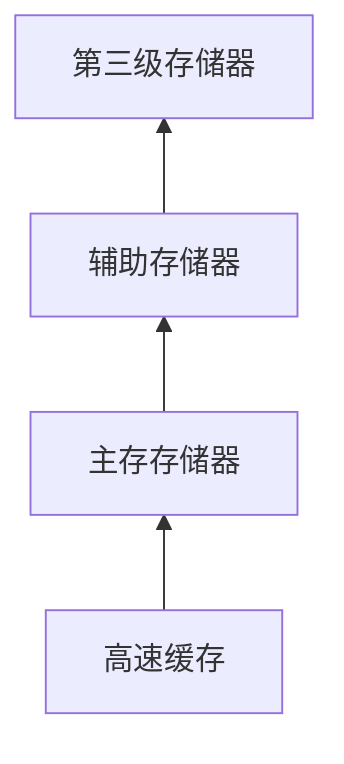

**辅助存储器**：磁盘和其他能够存储大量需要长期保存的数据的设备。

## 存储器层次

| 名称|容量级别 |主要用途 |
|-|-|-|
**高速缓存**|MB | 处理器数据缓存 | 
**主存存储器**| GB| 用| 程序执行时数据存储区域| 
**辅助存储器**|G/TB+ | 长期存储数据 | 
**第三级存储器**| * | 特殊存储例如 光盘、U盘、磁带、集群机器存储器等 | 