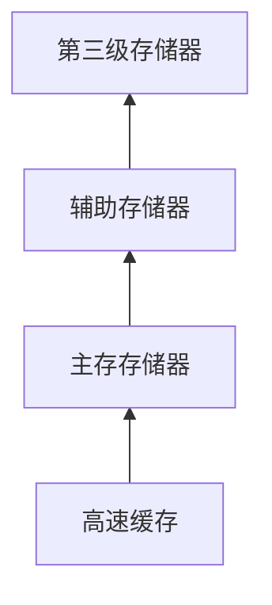

**辅助存储器**：磁盘和其他能够存储大量需要长期保存的数据的设备。

## 存储器层次

| 名称|容量级别 |主要用途 |
|-|-|-|
**高速缓存**|MB | 处理器数据缓存 | 
**主存存储器**| GB| 用| 程序执行时数据存储区域| 
**辅助存储器**|G/TB+ | 长期存储数据 | 
**第三级存储器**| * | 特殊存储例如 光盘、U盘、磁带、集群机器存储器等 | 

存储器层次间传送数据，将磁盘划分成磁盘块，当数据要被访问时将整块作为缓存进行传输。
易失和非易失存储器，根据断电后能够否完整保存数据区分。第三级存储器及辅助存储器通常都是非易失，高速缓存和主存存储器通常是易失。

## 磁盘

辅助存储器几乎都是基于磁盘，副主存储器的使用时数据库管理系统的重要特性之一。

磁盘由**磁盘片**组合和**磁头**组合构成，每个盘片由多个**磁道**组成，盘片中半径相同的磁道成为**柱面**。磁道又被**间隙**分隔成多个**扇区**。
由于磁盘读写需要通过磁头移动，盘片旋转进行数据的存取，所以在随机读取时速度十分慢。尽可能将相似文件组织在一块有利于提高访问速度。

**磁盘故障**有以下几种情况
- 间接性故障（某次读写扇区未成功，多次尝试后成功读写）
- 介质损坏（一个或多个二进制位永久损坏，以至于整个扇区无法正常读取）
- 写故障（在写入磁盘时发生异常，及没能正常写入，有无法检索先前的写入）
- 磁盘崩溃（整个磁盘变为永久不可读写）

